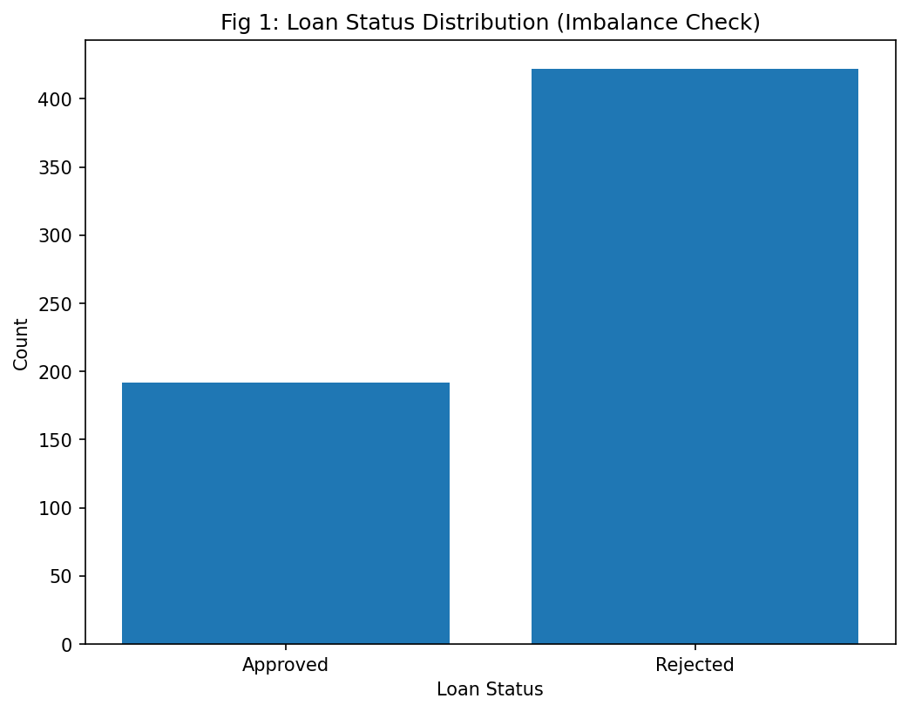
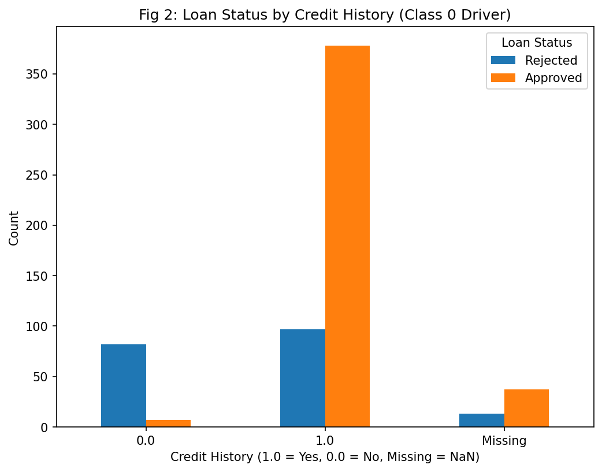
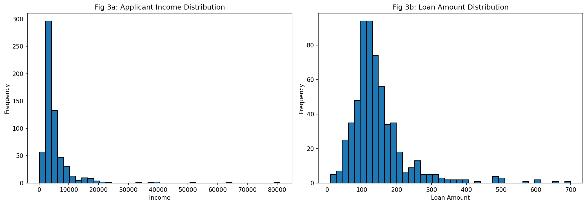
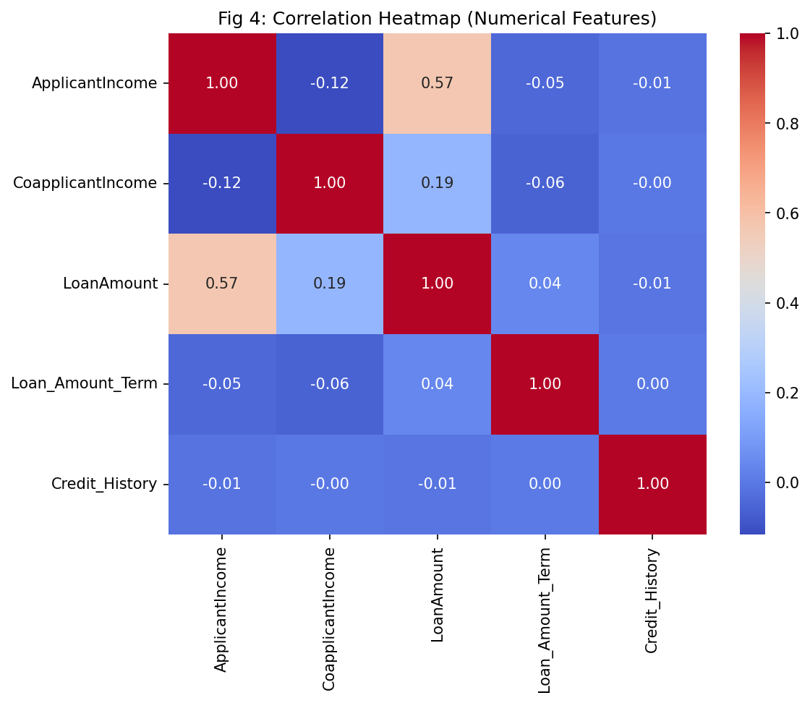
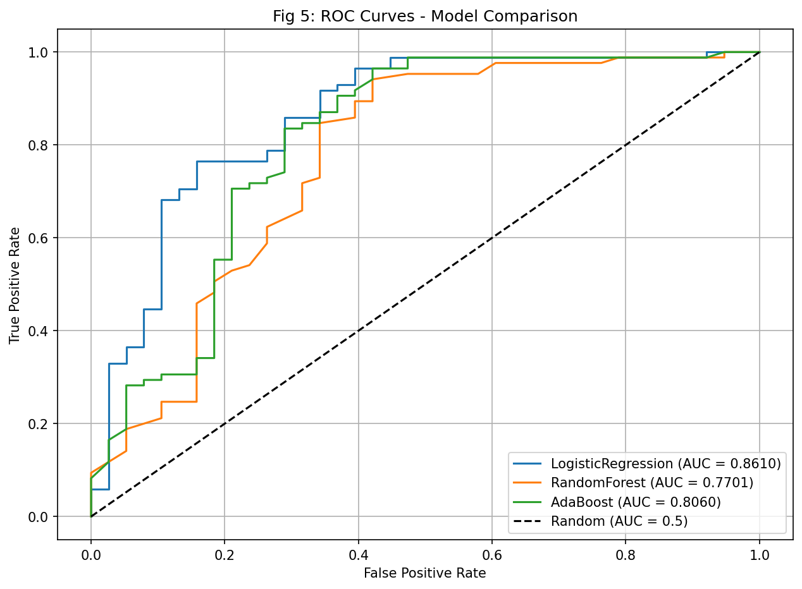
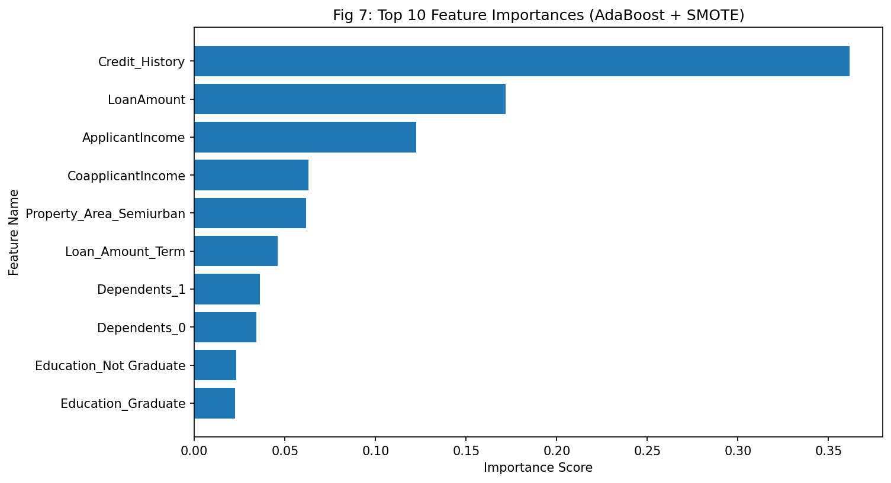
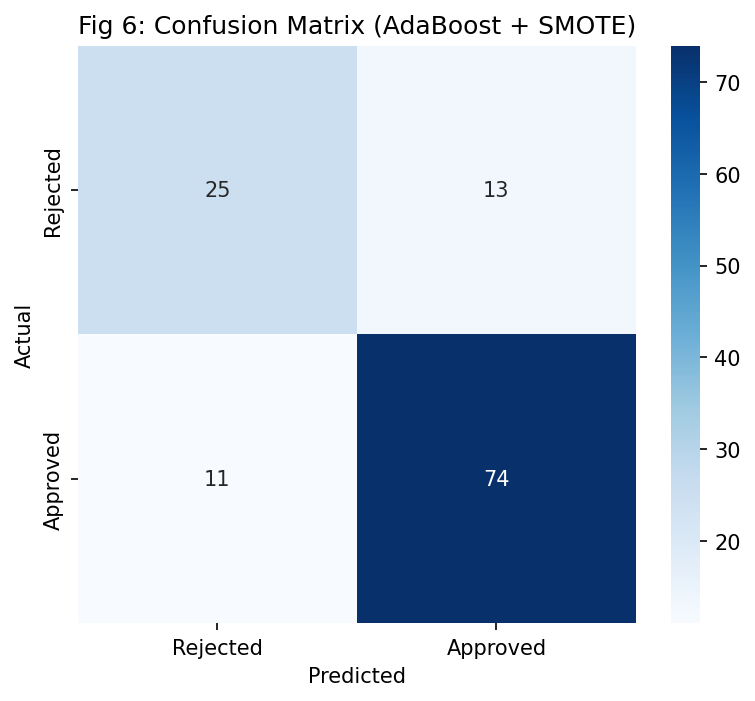
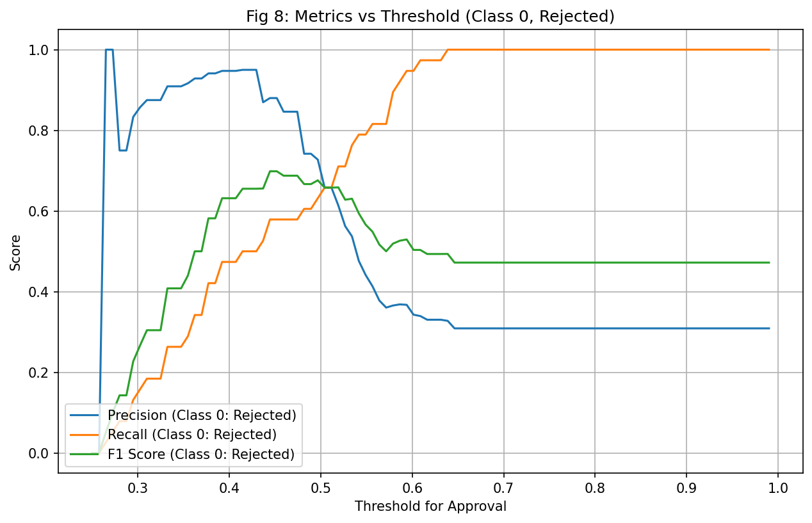
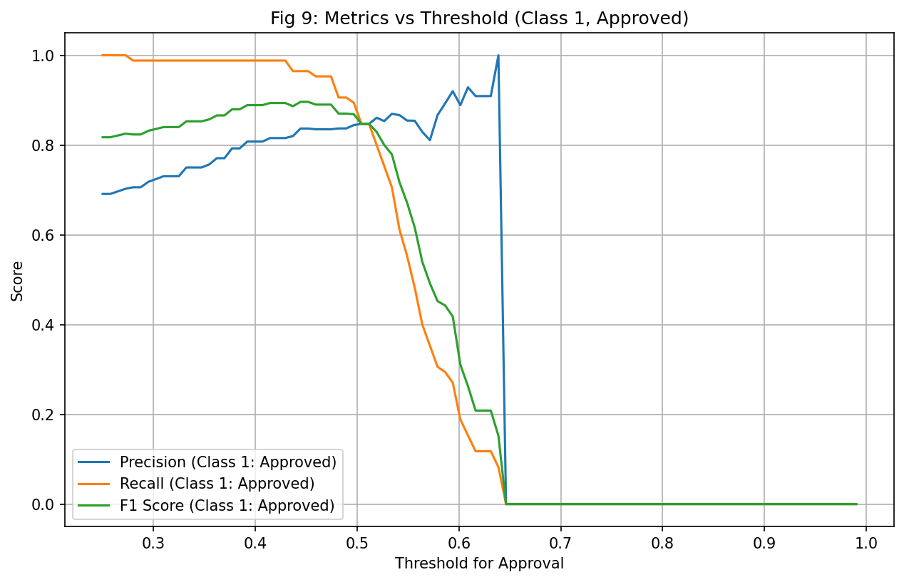

# Loan Approval Risk Analysis Using Machine Learning

## Overview

According to my research, 90% of Americans have some form of debt. Loans are a widely used system that benefits individuals and businesses. However, banks approving incorrectly to the wrong person may lead to financial risk and loss, while unnecessary rejection of a qualified applicant would be a missed revenue opportunity.

My project's goal is to develop a classification model that can predict loan approval status based on applicant's demographic, financial situation, and credit history.

Bank of America's official website stated that applicant's credit history is one of the most important factors for loan approvals. Thus I expect credit history to be the most important factor in approving applicant's loan.

---

## Dataset

- **Source**: [Kaggle - Loan Eligible Dataset](https://www.kaggle.com/datasets/vikasukani/loan-eligible-dataset)
- **Origin**: Dream Housing Finance (Mortgage Loan Matching Company)
- **Size**: 614 records
- **Features**: Gender, Marital Status, Education, Income, Loan Amount, Credit History
- **Target**: `Loan_Status` (Approved = 1, Rejected = 0)

### Missing Values

| Feature | Missing Count | Missing % |
|---------|:---:|:---:|
| Credit_History | 50 | 8.14 |
| Self_Employed | 32 | 5.21 |
| LoanAmount | 22 | 3.58 |
| Dependents | 15 | 2.44 |
| Loan_Amount_Term | 14 | 2.28 |
| Gender | 13 | 2.12 |
| Married | 3 | 0.49 |

### Data Wrangling

- **Numerical missing values**: Replaced with mean using `SimpleImputer` in a Pipeline
- **Categorical missing values**: Replaced with most frequent value using `SimpleImputer`
- **Numerical features**: Normalized with `StandardScaler`
- **Categorical features**: Converted to binary flags with `OneHotEncoder`
- All preprocessing grouped within a `ColumnTransformer` + `Pipeline`

---

## Exploratory Data Analysis (EDA)

### Class Imbalance

Approved (422) vs Rejected (192) — strong class imbalance identified. The model needs to perform well on the minority class (Rejected).

### Credit History as Key Driver

Credit history is confirmed as an important factor. Applicants with credit history have an overwhelmingly higher approval rate.

### Income & Loan Amount Distributions

Both Applicant Income and Loan Amount distributions are right-skewed with outliers.

### Correlation Heatmap

Applicant Income and Loan Amount have a moderate positive correlation (0.57), while Credit History has near-zero correlation with other numerical features — acting as an independent predictor.

---

## Modeling

- **Target**: `Loan_Status` — Binary Classification
- **Evaluation Focus**: Precision & Recall for Rejection (Class 0) prioritized for financial risk management
- **Validation**: 5-Fold Stratified Cross-Validation
- **Imbalance Handling**: SMOTE (Synthetic Minority Oversampling Technique)

### Model Comparison (5-Fold CV with SMOTE)

| Model | Accuracy | Precision | Recall | F1 | ROC-AUC |
|-------|:---:|:---:|:---:|:---:|:---:|
| LogisticRegression | 0.7087 ± 0.0631 | 0.6613 ± 0.0798 | 0.6612 ± 0.0803 | 0.6577 ± 0.0818 | 0.7283 ± 0.0900 |
| RandomForest | 0.7290 ± 0.0632 | 0.6917 ± 0.0780 | 0.6635 ± 0.0607 | 0.6699 ± 0.0662 | 0.7346 ± 0.0773 |
| **AdaBoost** | **0.7474 ± 0.0579** | **0.7111 ± 0.0687** | **0.6893 ± 0.0619** | **0.6942 ± 0.0664** | **0.7425 ± 0.0958** |

AdaBoost achieved the highest CV F1 score and was selected as the primary model for its stability and feature importance interpretability.

### Test Set Results (with SMOTE)

| Model | Accuracy | Precision (Class 0) | Recall (Class 0) | Precision (Class 1) | Recall (Class 1) |
|-------|:---:|:---:|:---:|:---:|:---:|
| LogisticRegression | 0.8293 | 0.7576 | 0.6579 | 0.8556 | 0.9059 |
| RandomForest | 0.7967 | 0.6970 | 0.6053 | 0.8333 | 0.8824 |
| AdaBoost | 0.8049 | 0.6944 | 0.6579 | 0.8506 | 0.8706 |

### ROC-AUC Comparison

Logistic Regression achieved the highest AUC (0.8610), suggesting simpler models may generalize better with small datasets.

---

## AdaBoost Detailed Analysis

### Feature Importances (with SMOTE)

With SMOTE applied, Credit History (0.36) became the most important feature, followed by Loan Amount (0.17) and Applicant Income (0.12). This aligns with the initial hypothesis. Without SMOTE, Loan Amount ranked first — the imbalanced data was distorting feature importance.

### Confusion Matrix

### Performance at Threshold 0.5

| Metric | Class 0 (Rejected) | Class 1 (Approved) |
|--------|:---:|:---:|
| Precision | 0.6944 | 0.8506 |
| Recall | 0.6579 | 0.8706 |
| F1-Score | 0.6757 | 0.8605 |
| **Accuracy** | **0.8049** | |

SMOTE improved Class 0 recall from **0.5789 → 0.6579** (+8 percentage points). The trade-off: Class 1 recall decreased from 0.976 to 0.871 as the model became more balanced.

### Financial Risk Analysis

| Category | Count | Meaning |
|----------|:---:|---------|
| True Positives (TP) | 74 | Safe Approvals |
| False Positives (FP) | 13 | Risky Approvals |
| True Negatives (TN) | 25 | Correctly Rejected |
| False Negatives (FN) | 11 | Missed Opportunities |

### Threshold Tuning

Default threshold 0.5 appears to be near the optimal point for maximizing F1 score for Class 0.

---

## Findings

- SMOTE + cross-validation improved Class 0 recall: **0.5789 → 0.6579**
- Logistic Regression achieved the best ROC-AUC (0.8610), while AdaBoost provided the best CV F1 and interpretable feature importances
- **Credit History** and **Loan Amount** confirmed as dominant predictive factors
- Model's rejection recall is still insufficient for real-world financial risk deployment, largely due to small dataset size (614 rows)

## Limitations

The biggest factor is the small sample size (614 rows), which limits generalizability. The class imbalance (68.7% Approved) further reduces the model's ability to learn rejection patterns.

## Future Directions

- Larger and more balanced dataset
- Hyperparameter tuning (GridSearchCV)
- Ensemble stacking
- Additional feature engineering (e.g., income-to-loan ratio)

---

## Tech Stack

- Python, Pandas, NumPy
- Scikit-learn (Pipeline, ColumnTransformer, StratifiedKFold)
- Imbalanced-learn (SMOTE)
- Matplotlib, Seaborn

## References

- [American Household Debt: Statistics and Demographics](https://www.debt.org/faqs/americans-in-debt/demographics/)
- [Factors Banks Consider Before Granting a Business Loan](https://business.bankofamerica.com/en/resources/factors-that-impact-loan-decisions-and-how-to-increase-your-approval-odds)
- [Loan Eligible Dataset (Kaggle)](https://www.kaggle.com/datasets/vikasukani/loan-eligible-dataset)
- [Loan Prediction w/ Various ML Models (Kaggle)](https://www.kaggle.com/code/caesarmario/loan-prediction-w-various-ml-models)
